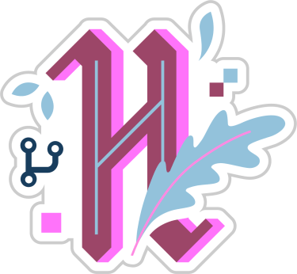

	<h1>
		Hi  there! I'm Beatriz Sopeña Merino
	</h1>
	<h3>
		web developer and grafic designer
	</h3>

 

	

		Presentation
	

	

		

			

				Welcome to my profile!
				 
				I'm Beatriz Sopeña Merino, Fullstack web developer and grafic designer from  Madrid, Spain.
				 
				Currently, I am working from home for the <a href="https://www.webpac.com/" target="_blank" rel="noopener noreferrer">Webpac</a> company as Frontend developer, I am finishing a <a href="https://github.com/beatrizsmerino/exercises-javascript-node" target="_blank" rel="noopener noreferrer">Master of Javascript and Node JS in Fizticia</a> and working in other <a href="https://www.crcanine.com/" target="_blank" rel="noopener noreferrer">projects as a freelance</a>.
				 
				I am passionate about learning and sharing my knowledge with others. In my free time I participate in open source projects as <a href="https://hacktoberfest.digitalocean.com/" target="_blank" rel="noopener noreferrer">Hacktoberfest</a>, you will always see me doing a course and learning something new. When I am not developing, I watch movies and series, play with the playstation or try to do some sport.
			

		

		

			

				
			

		

	

	

		Skills
	

	

		

			<h3>
				Design
			</h3>
			

				
				
				
				 
				
				
				 
				
			

		

		

			<h3>
				Frontend
			</h3>
			

				
				
				 
				
				
				
				 
				
				
				
				 
				
				
				
				 
				
				
				
				
				
			

		

		

			<h3>
				Backend
			</h3>
			

				
				 
				
				
				 
				
				 
				
				
				 
				
			

		

		

			<h3>
				Project documentation
			</h3>
			

				
				
			

		

		

			<h3>
				Project configuration
			</h3>
			

				
				
				 
				
				
				
				 
				
			

		

		

			<h3>
				Task runners
			</h3>
			

				
				
				 
				
				
				 
				
				
				
			

		

		

			<h3>
				Version Control
			</h3>
			

				
				
				 
				
				 
				
			

		

		

			<h3>
				Project management
			</h3>
			

				
				
				
				 
				
				
				 
				
			

		

		

			<h3>
				Code editors
			</h3>
			

				
				
				 
				
				
				 
				
				
			

		

		

			<h3>
				Browsers
			</h3>
			

				
				
				 
				
				
				 
				
				
			

		

		

			<h3>
				OS
			</h3>
			

				
				
				 
				
			

		

		

			<h3>
				Learn and share code
			</h3>
			

				
				
				 
				
				
				 
				
				
			

		

		

			<h3>
				Hobbies
			</h3>
			

				
				
				 
				
				
				
				
				 
				
				
				 
				
			

		

	

	

		GitHub Stats
	

	

		

			
			
		

	

	

		Hacktoberfest
	

	

		

			
			
			
		

	

