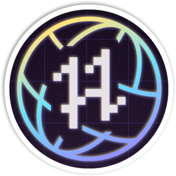
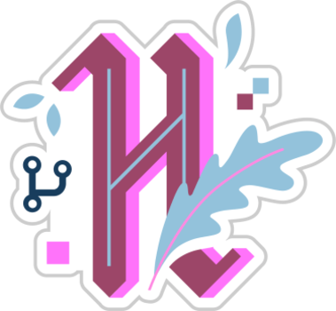

<div align="center">
	<h1>
		<span>
			Hi  there!
		</span>
		<br>
		<span>
			<a href="https://git.io/typing-svg">
				
			</a>
		</span>
	</h1>
</div>

<nav>
	<p align="center">
		<a href="#profile">
			Profile
		</a>
		|
		<a href="#skills">
			Skills
		</a>
		|
		<a href="#events">
			Events
		</a>
		|
		<a href="#stats">
			Stats
		</a>
	</p>
	<p align="center">
    	<a href="https://www.linkedin.com/in/beatrizsmerino/">
    		
    	</a>
		<a href="https://www.instagram.com/beatrizsmerino/">
    		
    	</a>
		<a href="https://codesandbox.io/u/beatrizsmerino">
    		
    	</a>
		<a href="https://codepen.io/beatrizsmerino/">
    		
    	</a>
    </p>
</nav>

<details id="profile" open="true">
	<summary>
		
	</summary>
	<div>
		<div>
			<p>
				Welcome to my profile!
				<br>
				I am Beatriz Sopeña Merino, 💻 Website Developer and 🎨 Graphic Designer from  Madrid, Spain.
				<br>
				Currently, I work from home for a company as a 💼 <strong>Senior Frontend Developer</strong> and sometimes I am also involved in several freelance projects.
				<br>
				I have a strong passion for continuous 🎓 <strong>learning and sharing</strong> my expertise with others. In my free time, I contribute to open source projects like <a href="https://hacktoberfest.digitalocean.com/">Hacktoberfest</a>, you will always find me taking a course or diving into something new to enhance my skills. When I am not coding or designing, I enjoy watching 🎬 movies and series, 🎮 playing video games or 🥾 hiking.
			</p>
		</div>
	</div>
</details>

<details id="skills" open="true">
	<summary>
		
	</summary>
	<div>
		<ul>
			<li>
				<details id="design" open="true">
					<summary>
						Design
					</summary>
					<p>
						
						
						
						<br>
						
						
						<br>
						
					</p>
				</details>
			</li>
			<li>
				<details id="frontend" open="true">
					<summary>
						Frontend
					</summary>
					<p>
						
						
						<br>
						
						
						
						
						<br>
						
						
						<br>
						
						
						
						<br>
						
						
						
						
						
						<br>
						
						
						
					</p>
				</details>
			</li>
			<li>
				<details id="backend" open="true">
					<summary>
						Backend
					</summary>
					<p>
						
						<br>
						
						
						<br>
						
						<br>
						
						
						<br>
						
					</p>
				</details>
			</li>
			<li>
				<details id="project-documentation">
					<summary>
						Project documentation
					</summary>
					<p>
						
						
					</p>
				</details>
			</li>
			<li>
				<details id="project-configuration">
					<summary>
						Project configuration
					</summary>
					<p>
						
						
						<br>
						
						
						
						<br>
						
					</p>
				</details>
			</li>
			<li>
				<details id="task-runners">
					<summary>
						Task runners
					</summary>
					<p>
						
						
						<br>
						
						
						<br>
						
						
						
					</p>
				</details>
			</li>
			<li>
				<details id="version-control">
					<summary>
						Version Control
					</summary>
					<p>
						
						
						<br>
						
						<br>
						
					</p>
				</details>
			</li>
			<li>
				<details id="project-management">
					<summary>
						Project management
					</summary>
					<p>
						
						
						<br>
						
						
						<br>
						
						
						
						
						<br>
						
					</p>
				</details>
			</li>
			<li>
				<details id="code-editors">
					<summary>
						Code editors
					</summary>
					<p>
						
						
						<br>
						
						
						<br>
						
						
					</p>
				</details>
			</li>
			<li>
				<details id="browsers">
					<summary>
						Browsers
					</summary>
					<p>
						
						
						<br>
						
						
						<br>
						
						
					</p>
				</details>
			</li>
			<li>
				<details id="operating-system">
					<summary>
						OS
					</summary>
					<p>
						
						
						<br>
						
					</p>
				</details>
			</li>
			<li>
				<details id="learn-share-code">
					<summary>
						Learn and share code
					</summary>
					<p>
						<a href="https://github.com/beatrizsmerino">
							
						</a>
						
						<br>
						<a href="https://codepen.io/beatrizsmerino/">
							
						</a>
						<a href="https://codesandbox.io/u/beatrizsmerino">
							
						</a>
						<br>
						
						<a href="https://stackoverflow.com/users/10855837/beatrizsmerino">
							
						</a>
					</p>
				</details>
			</li>
			<li>
				<details id="hobbies">
					<summary>
						Hobbies
					</summary>
					<p>
						
						
						<br>
						
						
						
						
						<br>
						
						
						<br>
						
					</p>
				</details>
			</li>
		</ul>
	</div>
</details>

<details id="events" open="true">
	<summary>
		
	</summary>
	<div>
		<h3>
			Hacktoberfest
		</h3>
		<table>
			<tr>
				<th>2023</th>
				<th>2022</th>
				<th>2021</th>
				<th>2020</th>
				<th>2019</th>
			</tr>
			<tr>
				<td>
					<a href="./README/images/hacktoberfest/original/hacktoberfest-2023.svg">
						
					</a>
				</td>
				<td>
					<a href="./README/images/hacktoberfest/original/hacktoberfest-2022.png">
						
					</a>
				</td>
				<td>
					<a href="./README/images/hacktoberfest/original/hacktoberfest-2021.png">
						
					</a>
				</td>
				<td>
					<a href="./README/images/hacktoberfest/original/hacktoberfest-2020.png">
						
					</a>
				</td>
				<td>
					<a href="./README/images/hacktoberfest/original/hacktoberfest-2019.png">
	  					
					</a>
				</td>
			</tr>
		</table>
	</div>
</details>

<details id="stats" open="true">
	<summary>
		
	</summary>
	<div>
		<p>
			<a href="https://github-readme-stats.vercel.app/api?username=beatrizsmerino&count_private=true&show=reviews,discussions_started,discussions_answered,prs_merged,prs_merged_percentage&theme=vue-dark&show_icons=true">
				
			</a>
			<a href="https://github-readme-stats.vercel.app/api/top-langs/?username=beatrizsmerino&layout=compact&langs_count=10&theme=vue-dark">
				
			</a>
    	</p>
		<p>
		    <a href="https://streak-stats.demolab.com?user=beatrizsmerino&theme=vue-dark&sideNums=white&currStreakNum=white&fire=white&dates=ffffff80">
    			
    		</a>
		</p>
    	<p>
    		<a href="https://wakatime.com/@beatrizsmerino">
    			
    		</a>
    	</p>
    </div>
</details>

<!--START_SECTION:waka-->


**🐱 My GitHub Data** 

> 📦 1.3 MB Used in GitHub's Storage 
 > 
> 🏆 2,398 Contributions in the Year 2024
 > 
> 🚫 Not Opted to Hire
 > 
> 📜 29 Public Repositories 
 > 
> 🔑 5 Private Repositories 
 > 
**I'm a Night 🦉** 

```text
🌞 Morning                3546 commits        ███░░░░░░░░░░░░░░░░░░░░░░   12.85 % 
🌆 Daytime                6259 commits        ██████░░░░░░░░░░░░░░░░░░░   22.68 % 
🌃 Evening                8615 commits        ████████░░░░░░░░░░░░░░░░░   31.22 % 
🌙 Night                  9176 commits        ████████░░░░░░░░░░░░░░░░░   33.25 % 
```
📅 **I'm Most Productive on Monday** 

```text
Monday                   4834 commits        ████░░░░░░░░░░░░░░░░░░░░░   17.52 % 
Tuesday                  3715 commits        ███░░░░░░░░░░░░░░░░░░░░░░   13.46 % 
Wednesday                4609 commits        ████░░░░░░░░░░░░░░░░░░░░░   16.70 % 
Thursday                 4258 commits        ████░░░░░░░░░░░░░░░░░░░░░   15.43 % 
Friday                   3843 commits        ███░░░░░░░░░░░░░░░░░░░░░░   13.93 % 
Saturday                 2673 commits        ██░░░░░░░░░░░░░░░░░░░░░░░   09.69 % 
Sunday                   3664 commits        ███░░░░░░░░░░░░░░░░░░░░░░   13.28 % 
```


📊 **This Week I Spent My Time On** 

```text
🕑︎ Time Zone: Europe/Madrid

💬 Programming Languages: 
JavaScript               11 hrs 58 mins      ████████████░░░░░░░░░░░░░   47.57 % 
JSON                     6 hrs 2 mins        ██████░░░░░░░░░░░░░░░░░░░   24.00 % 
Vue.js                   3 hrs 52 mins       ████░░░░░░░░░░░░░░░░░░░░░   15.37 % 
Other                    1 hr 44 mins        ██░░░░░░░░░░░░░░░░░░░░░░░   06.91 % 
HTML                     1 hr 14 mins        █░░░░░░░░░░░░░░░░░░░░░░░░   04.92 % 

🔥 Editors: 
VS Code                  25 hrs 11 mins      █████████████████████████   100.00 % 

🐱‍💻 Projects: 
vue-editor               24 hrs 55 mins      █████████████████████████   98.92 % 
vue-todolist             16 mins             ░░░░░░░░░░░░░░░░░░░░░░░░░   01.08 % 

💻 Operating System: 
Mac                      25 hrs 11 mins      █████████████████████████   100.00 % 
```

**I Mostly Code in JavaScript** 

```text
JavaScript               11 repos            ████████░░░░░░░░░░░░░░░░░   31.43 % 
Vue                      7 repos             █████░░░░░░░░░░░░░░░░░░░░   20.00 % 
HTML                     6 repos             ████░░░░░░░░░░░░░░░░░░░░░   17.14 % 
TypeScript               1 repo              █░░░░░░░░░░░░░░░░░░░░░░░░   02.86 % 
Sass                     1 repo              █░░░░░░░░░░░░░░░░░░░░░░░░   02.86 % 
```


**Timeline**


<!--END_SECTION:waka-->
